# Lab 2

    本节目标：
      1. 安装适合的 IDE
      2. 编写本学期第一个 C 程序

## 获取及提交lab

**获取**：通过 `https://github.com/C-FUDAN-2020/lab2`，获取（建议通过Download ZIP方式下载）。

**提交物**：将你完成目标2的源代码文件作为 lab1 的提交物。

**提交**：将提交物文档命名为学号_姓名 （如20302010000_王明），提交至超星学习通对应的作业中。

**截止时间**：北京时间 2020年9月27日 23:59:59 

## 安装IDE

在开始编程之前，我们可以选择一个自己喜欢的 IDE (集成开发环境) 来作为 C/C++ 开发工具。

IDE 可以分为日常实践和项目开发两种类型。
日常实践型的 IDE 有：`Vim`, `Sublime Text 3`, `VSCode` 和 `Atom`。项目开发型的 IDE 有：`VS` 和 `CLion`。
接下来会介绍下 `VSCode` 和 `CLion`，大家对其他 IDE 有兴趣的话可以课后自行百度 or Google。

> 注意：如果嫌麻烦，大家可以**跳过**这一步，查看[便捷安装IDE](#便捷安装IDE)。Windows 使用 `DEV-C++`, Mac 使用 `XCode`

1. VSCode

    `VSCode` 全称 Visual Studio Code，由 Microsoft 的 Eric Gamma 率领团队开发而成，它的前身是在线编辑器 [monaco editor](https://microsoft.github.io/monaco-editor/index.html)。当今它是最受欢迎的免费开源代码编辑器。

    可以通过[官网](https://code.visualstudio.com/)下载 `VSCode`。*(安装时选择安装路径)。* 刚下载下来它只是一个简单的编辑器，但是 `VSCode` 有丰富的插件来扩展它的实用性。

    在 `VSCode` 中调用 `Ctrl + Shift + X` 快捷键打开扩展栏，输入 `chinese` 安装中文插件，汉化编辑器。

    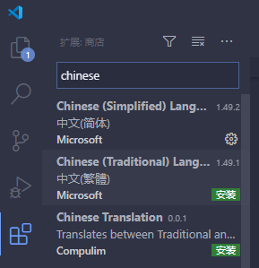

    输入 `C/C++` 安装 C/C++ ，它提供了静态检查，智能感知，调试等功能。

    使用 `VSCode` 编辑好你的代码后，可以调用 Ctrl + ` 打开内置命令行，然后依照上节课所教的方法使用命令行运行文件，更多关于编译、调试的配置可以参考[知乎上的解答](https://zhuanlan.zhihu.com/p/87864677)或者自行百度 or Google

    > 你也可以输入'material icon theme' 美化 VSCode 小图标；输入'material theme' 美化 VSCode UI 界面

2. CLion

    `CLion` 是一款适用于 C 和 C++ 的跨平台 IDE，属于 [JetBrains](https://www.jetbrains.com/) 家族。它的定位是一个完整的现代化 C\C++ 工具，具有功能强大的智能编码辅助和代码分析模块。

    `CLion` 属于付费软件，首次[下载](https://www.jetbrains.com/clion/)可以免费使用 30 天。学生可以使用 `edu` 邮箱注册 JetBrains 帐号，然后就能免费使用 JetBrains 家族所有 IDE 的 ULTIMATE 版本。

    安装 `Clion` 也要选择安装路径，接下来可以全选配置选项，然后直接安装。

    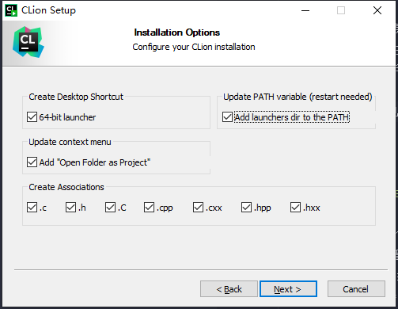

    安装完成会问你是否重启电脑，建议重启一下。

    重启后运行 `Clion`，按默认配置点击继续，直到出现配置 `Toolchains` 的界面。

    该界面没有问题则直接启动，如果出现类似下图的问题，则需要特别处理。

    > 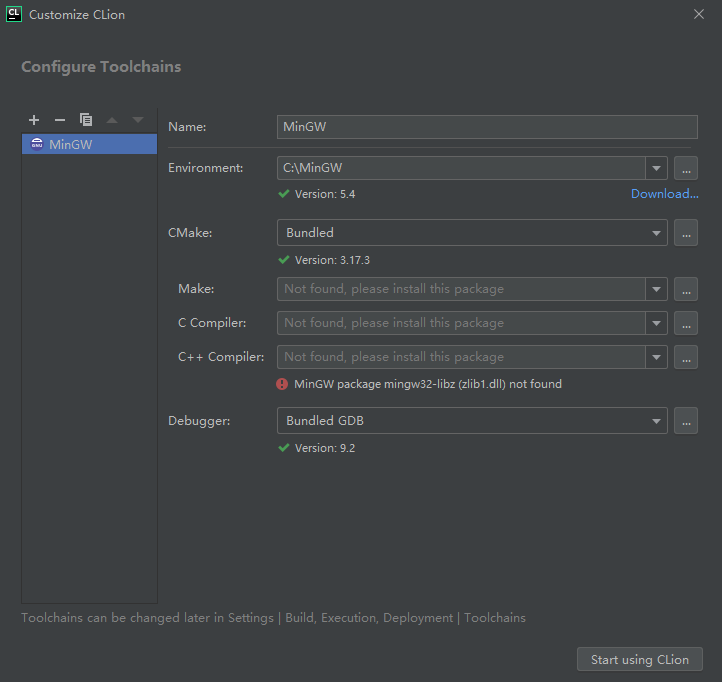
    > 这里需要使用 MinGW Installer 安装两个包：`mingw32-libz-dll` 和 `mingw32-make-bin`
    > 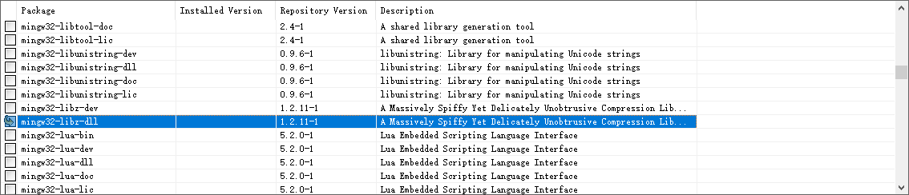
    > 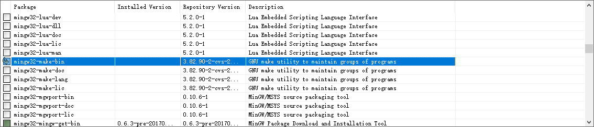
    > 之后 Apply Changes 即可
    >
    > *Tips: Mac 用户一般不会出现以上问题，如果出现，请询问助教*

    特殊处理后，启动 `CLion`，创建新项目 ("New Project")，选择 C99

    > 注意：记得给项目命名！

    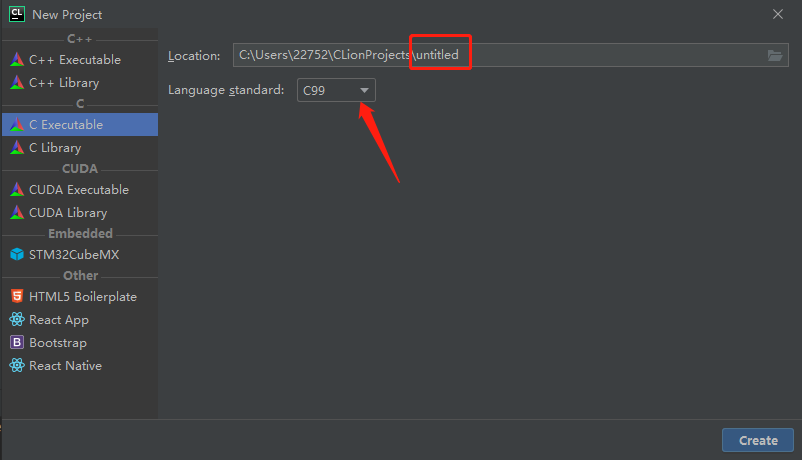

    
    创建好项目后 `CLion` 会自动生成 `main.c` 文件，点击右上角小三角图标，自动编译运行代码，输出结果会打印在输出框里。

    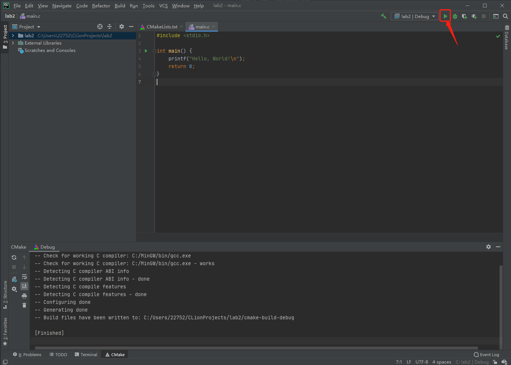

    `CLion` 的更多使用方法请查看[这里](https://www.jetbrains.com/clion/features/)或自行百度 or Google

## 便捷安装IDE

1. Windows 安装 `DEV-C++`

    `DEV-C++` 是一个 Windows 下的 C 和 C++ 程序的集成开发环境。它使用 MingW32/GCC 编译器，遵循C/C++ 标准。开发环境包括多页面窗口、工程编辑器以及调试器等，在工程编辑器中集合了编辑器、编译器、连接程序和执行程序，提供高亮度语法显示的，以减少编辑错误，还有完善的调试功能，能够适合初学者与编程高手的不同需求，是学习 C 或 C++ 的首选开发工具。

    你可以从 [SourceForge](https://en.wikipedia.org/wiki/SourceForge) 提供的[下载网址](https://sourceforge.net/projects/orwelldevcpp/)下载安装包，再双击点击安装。具体流程如下：

    Step 1: 先选择 English, 点击 ok

    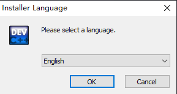

    Step 2: 接下来使用默认配置，直到选择安装文件夹时，选择自己希望安装的位置，安装

    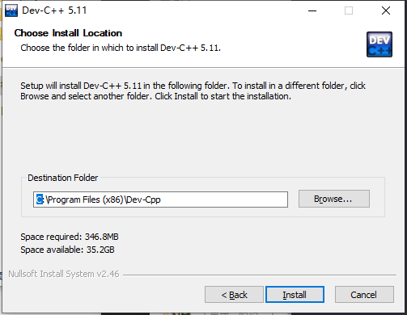

    Step 3: 第一次运行 DEV-C++，选择语言和界面配置(这里看个人喜好)

    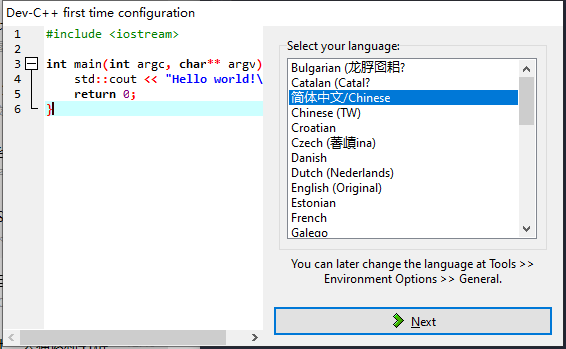
    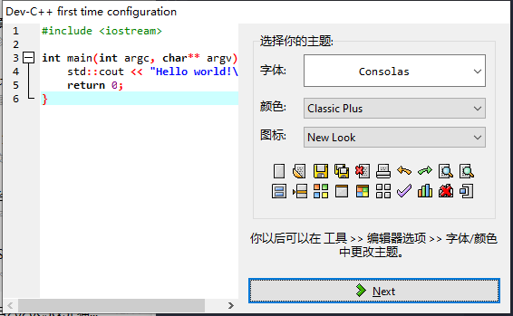

    Step 4: 创建/编辑你的程序

    选择 "文件 > 新建 > 源代码" 即可新建文件，然后进行你自己的编程叭！

    Step 5: 编译/运行

    在 "运行" 处有具体操作选项，一般我们会使用 "编译运行"，即快捷键 `F11` 编译运行程序

2. MacOS 安装 `XCode`

    `XCode` 由 Apple Inc 开发，是开发 macOS 和 iOS 应用程序的最快捷的方式。`Xcode` 具有统一的用户界面设计，编码、测试、调试都在一个简单的窗口内完成。它支持 Objective-C、C、C++、Swift 等语言。

    你可以在 `APP Store` 内下载（上节课已经介绍过了），`XCode` 的更多功能可以参看[链接](https://developer.apple.com/cn/xcode/)探索。

## 编写本学期第一个 C 程序

Please write a program, input your student ID, and output greetings to the student with that student ID.

constraints:

    id.length <= 11
input:

    > 20302010000
output:

    > Hello, student 20302010000!

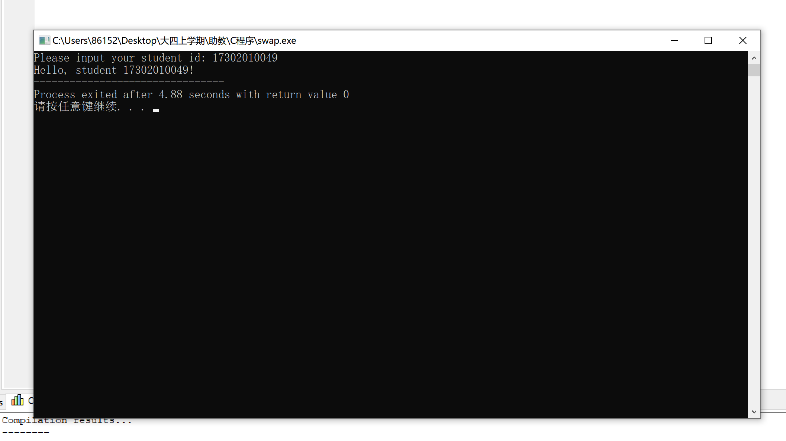

## Reference

[1] https://code.visualstudio.com/docs/cpp/config-mingw

[2] https://www.jetbrains.com/clion/features/

[3] https://en.wikipedia.org/wiki/Dev-C%2B%2B

[4] https://developer.apple.com/cn/xcode/